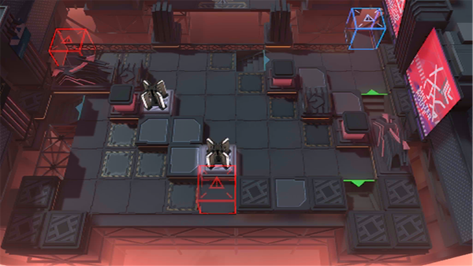

# 关卡一览————NL-S-2

## 关卡一览

关卡编号: NL-S-2

关卡名称: 冠军街道

目标点生命值: 3

敌人总数: 32

理智消耗: 15

## 关卡地图

## 敌人情况

| 敌人图片 | 敌人名称 | 数量  |
|---------|-----|-----|
| ./eneIcons/eneIcons/¡°×îºóµÄÇÓѦ¡±£¬ÍØÀ­.png| “最后的怯薛”，拓拉  |   1  |
| ./eneIcons/eneIcons/°µ³±Ç¯ÊÞ¡¤¦Á.png| 暗潮钳兽·α  |   8  |
| ./eneIcons/eneIcons/ÃÎ÷Ê×·ËæÕß.png| 梦魇追随者  |   1  |
| ./eneIcons/eneIcons/ÆïÊ¿ÁìÕÝ·üÕß.png| 骑士领蛰伏者  |   5  |
| ./eneIcons/eneIcons/ÎÞëÐÃË´Ì¿Í×鳤.png| 无胄盟刺客组长  |   5  |
| ./eneIcons/eneIcons/ÎÞëÐÃËåóÊÖ×鳤.png| 无胄盟弩手组长  |   12  |
