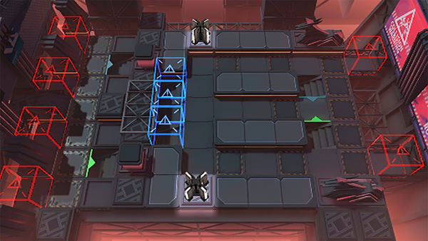

# 关卡一览————NL-S-3

## 关卡一览

关卡编号: NL-S-3

关卡名称: 散华驻地

目标点生命值: 3

敌人总数: 86

理智消耗: 20

## 关卡地图

## 敌人情况

| 敌人图片 | 敌人名称 | 数量  |
|---------|-----|-----|
| ./eneIcons/eneIcons/°µ³±Ç¯ÊÞ¡¤¦Á.png| 暗潮钳兽·α  |   28  |
| ./eneIcons/eneIcons/³Ö¶Ü¾«ÈñÆïÊ¿.png| 持盾精锐骑士  |   10  |
| ./eneIcons/eneIcons/ºôÐ¥ÆïÊ¿Íž«Èñ.png| 呼啸骑士团精锐  |   9  |
| ./eneIcons/eneIcons/É¢»ªÆïÊ¿Íž«Èñ.png| 散华骑士团精锐  |   5  |
| ./eneIcons/eneIcons/É¢»ªÆïÊ¿ÍÅѧͽ.png| 散华骑士团学徒  |   4  |
| ./eneIcons/eneIcons/ÎÞÃû¾«ÈñÆïÊ¿.png| 无名精锐骑士  |   29  |
| ./eneIcons/eneIcons/ÖòÆïÊ¿Þ±Þ±°²ÄÈ.png| 烛骑士薇薇安娜  |   1  |
