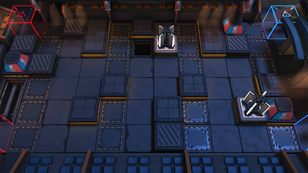

# 关卡一览————NL-S-4

## 关卡一览

关卡编号: NL-S-4

关卡名称: 赤盏驻地

目标点生命值: 3

敌人总数: 32

理智消耗: 20

## 关卡地图

## 敌人情况

| 敌人图片 | 敌人名称 | 数量  |
|---------|-----|-----|
| ./eneIcons/eneIcons/ÃÎ÷Ê×·ËæÕß.png| 梦魇追随者  |   1  |
| ./eneIcons/eneIcons/ÄýѪ֮ÈÐ.png| 凝血之刃  |   0  |
| ./eneIcons/eneIcons/ÆïÊ¿ÁìÕÝ·üÕß.png| 骑士领蛰伏者  |   3  |
| ./eneIcons/eneIcons/ÎÞÃû¾«ÈñÆïÊ¿.png| 无名精锐骑士  |   16  |
| ./eneIcons/eneIcons/ÎÞëÐÃË´Ì¿Í×鳤.png| 无胄盟刺客组长  |   4  |
| ./eneIcons/eneIcons/ÎÞëÐÃËåóÊÖ×鳤.png| 无胄盟弩手组长  |   6  |
| ./eneIcons/eneIcons/ѪÆïÊ¿µÒ¿ª¶í²¨Àû˹.png| 血骑士狄开俄波利斯  |   1  |
| ./eneIcons/eneIcons/ÖòÆïÊ¿Þ±Þ±°²ÄÈ.png| 烛骑士薇薇安娜  |   1  |
