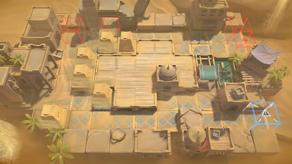

# 关卡一览————OD-2

## 关卡一览

关卡编号: OD-2

关卡名称: 扩大防守范围

目标点生命值: 5

敌人总数: 32

理智消耗: 12

## 关卡地图

## 敌人情况

| 敌人图片 | 敌人名称 | 数量  |
|---------|-----|-----|
| ./eneIcons/eneIcons/±äÒìɳµØÊÞ.png| 变异沙地兽  |   13  |
| ./eneIcons/eneIcons/±äÒìÑÒÖë.png| 变异岩蛛  |   17  |
| ./eneIcons/eneIcons/»û±ä׸ÉúÎï.png| 畸变赘生物  |   0  |
| ./eneIcons/eneIcons/Èø¿¨×È´ó½£ÊÖ.png| 萨卡兹大剑手  |   1  |
| ./eneIcons/eneIcons/Èø¿¨×ȵ¶±ø.png| 萨卡兹刀兵  |   1  |
