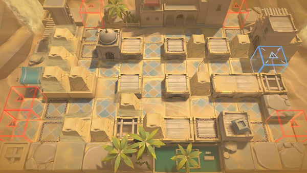

# 关卡一览————OD-3

## 关卡一览

关卡编号: OD-3

关卡名称: 安全屋攻防战

目标点生命值: 3

敌人总数: 49

理智消耗: 12

## 关卡地图

## 敌人情况

| 敌人图片 | 敌人名称 | 数量  |
|---------|-----|-----|
| ./eneIcons/eneIcons/±äÒìÑÒÖë.png| 变异岩蛛  |   10  |
| ./eneIcons/eneIcons/»û±äÌå¿þÀÜ.png| 畸变体傀儡  |   38  |
| ./eneIcons/eneIcons/»û±ä׸ÉúÎï.png| 畸变赘生物  |   0  |
| ./eneIcons/eneIcons/Èø¿¨×Ⱦѻ÷ÊÖ.png| 萨卡兹狙击手  |   1  |
