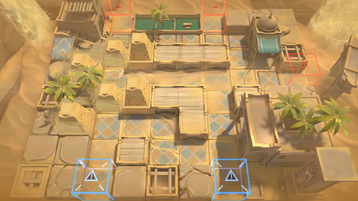

# 关卡一览————OD-4

## 关卡一览

关卡编号: OD-4

关卡名称: 场地清理

目标点生命值: 3

敌人总数: 30

理智消耗: 12

## 关卡地图

## 敌人情况

| 敌人图片 | 敌人名称 | 数量  |
|---------|-----|-----|
| ./eneIcons/eneIcons/±äÒìɳµØÊÞ.png| 变异沙地兽  |   10  |
| ./eneIcons/eneIcons/»û±äÌå¿þÀÜ.png| 畸变体傀儡  |   18  |
| ./eneIcons/eneIcons/»û±ä׸ÉúÎï.png| 畸变赘生物  |   0  |
| ./eneIcons/eneIcons/Դʯ»û±äÌå.png| 源石畸变体  |   2  |
