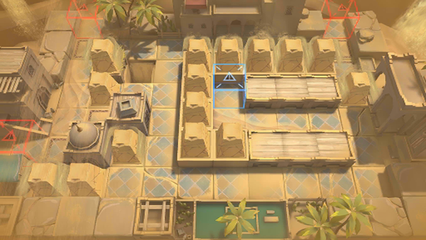

# 关卡一览————OD-6

## 关卡一览

关卡编号: OD-6

关卡名称: 领主宅邸攻防战

目标点生命值: 3

敌人总数: 50

理智消耗: 12

## 关卡地图

## 敌人情况

| 敌人图片 | 敌人名称 | 数量  |
|---------|-----|-----|
| ./eneIcons/eneIcons/¡°ºì±ê¡±¸ù³ýÕß.png| “红标”根除者  |   2  |
| ./eneIcons/eneIcons/¡°ºì±ê¡±Éø͸Õß.png| “红标”渗透者  |   4  |
| ./eneIcons/eneIcons/»û±äÌå¿þÀÜ.png| 畸变体傀儡  |   42  |
| ./eneIcons/eneIcons/»û±ä׸ÉúÎï.png| 畸变赘生物  |   0  |
| ./eneIcons/eneIcons/È«Ï¢»ÃÓ°.png| 全息幻影  |   0  |
| ./eneIcons/eneIcons/Èø¿¨×È´ó½£ÊÖ.png| 萨卡兹大剑手  |   2  |
