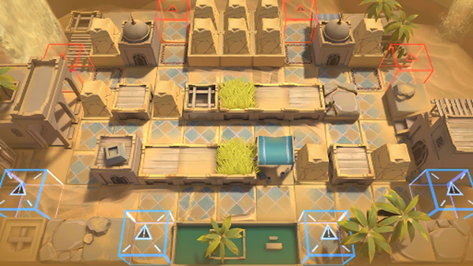

# 关卡一览————OD-EX-3

## 关卡一览

关卡编号: OD-EX-3

关卡名称: 伏击战

目标点生命值: 3

敌人总数: 38

理智消耗: 15

## 关卡地图

## 敌人情况

| 敌人图片 | 敌人名称 | 数量  |
|---------|-----|-----|
| ./eneIcons/eneIcons/¡°ºì±ê¡±¾«Ó¢Éø͸Õß.png| “红标”精英渗透者  |   8  |
| ./eneIcons/eneIcons/±äÒìɳµØÊÞ¦Á.png| 变异沙地兽α  |   15  |
| ./eneIcons/eneIcons/±äÒìÑÒÖë¦Á.png| 变异岩蛛α  |   15  |
| ./eneIcons/eneIcons/»û±ä¶ñÐÔÁö.png| 畸变恶性瘤  |   0  |
| ./eneIcons/eneIcons/È«Ï¢»ÃÓ°MK2.png| 全息幻影MK2  |   0  |
