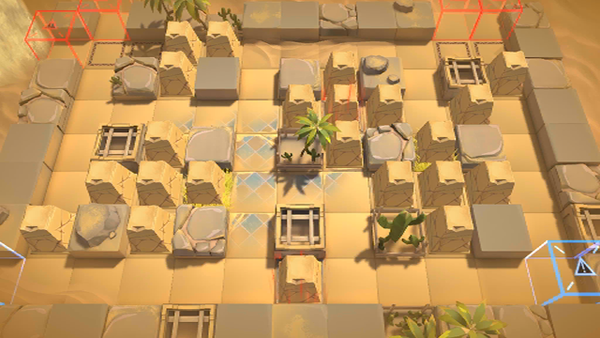

# 关卡一览————OD-EX-4

## 关卡一览

关卡编号: OD-EX-4

关卡名称: 爆破战术

目标点生命值: 3

敌人总数: 16

理智消耗: 15

## 关卡地图

## 敌人情况

| 敌人图片 | 敌人名称 | 数量  |
|---------|-----|-----|
| ./eneIcons/eneIcons/±äÒì¾ÞÑÒÖë¦Á.png| 变异巨岩蛛α  |   2  |
| ./eneIcons/eneIcons/»û±ä¶ñÐÔÁö.png| 畸变恶性瘤  |   0  |
| ./eneIcons/eneIcons/Դʯ»û±äÌå.png| 源石畸变体  |   7  |
| ./eneIcons/eneIcons/Դʯ»û±äÌå¦Á.png| 源石畸变体α  |   7  |
