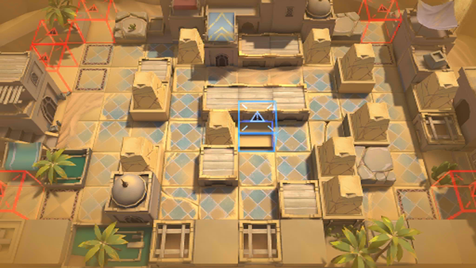

# 关卡一览————OD-EX-7

## 关卡一览

关卡编号: OD-EX-7

关卡名称: 要塞

目标点生命值: 3

敌人总数: 36

理智消耗: 20

## 关卡地图

## 敌人情况

| 敌人图片 | 敌人名称 | 数量  |
|---------|-----|-----|
| ./eneIcons/eneIcons/¡°ºì±ê¡±¾«Ó¢¸ù³ýÕß.png| “红标”精英根除者  |   3  |
| ./eneIcons/eneIcons/¡°ºì±ê¡±¾«Ó¢Éø͸Õß.png| “红标”精英渗透者  |   6  |
| ./eneIcons/eneIcons/±äÒìÑÒÖë¦Á.png| 变异岩蛛α  |   5  |
| ./eneIcons/eneIcons/»û±ä¶ñÐÔÁö.png| 畸变恶性瘤  |   0  |
| ./eneIcons/eneIcons/»û±äÌå¿þÀÜ.png| 畸变体傀儡  |   20  |
| ./eneIcons/eneIcons/»û±ä׸ÉúÎï.png| 畸变赘生物  |   0  |
| ./eneIcons/eneIcons/È«Ï¢»ÃÓ°MK2.png| 全息幻影MK2  |   0  |
| ./eneIcons/eneIcons/Դʯ»û±äÌå¦Á.png| 源石畸变体α  |   2  |
