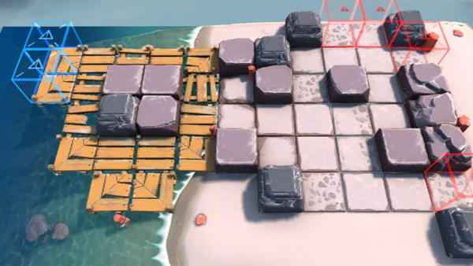

# 关卡一览————OF-1

## 关卡一览

关卡编号: OF-1

关卡名称: 火山制造

目标点生命值: 10

敌人总数: 43

理智消耗: 12

## 关卡地图

## 敌人情况

| 敌人图片 | 敌人名称 | 数量  |
|---------|-----|-----|
| ./eneIcons/eneIcons/ËáҺԴʯ³æ.png| 酸液源石虫  |   9  |
| ./eneIcons/eneIcons/Դʯ³æ.png| 源石虫  |   17  |
| ./eneIcons/eneIcons/Դʯ³æ¡¤¦Â.png| 源石虫·β  |   17  |
