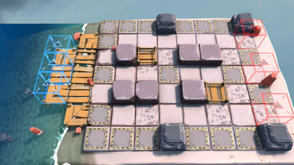

# 关卡一览————OF-2

## 关卡一览

关卡编号: OF-2

关卡名称: 演出继续

目标点生命值: 8

敌人总数: 38

理智消耗: 16

## 关卡地图

## 敌人情况

| 敌人图片 | 敌人名称 | 数量  |
|---------|-----|-----|
| ./eneIcons/eneIcons/²½±ø.png| 步兵  |   18  |
| ./eneIcons/eneIcons/»ú¶¯ÎÀ±ø.png| 机动卫兵  |   8  |
| ./eneIcons/eneIcons/ÁÔ¹·.png| 猎狗  |   12  |
