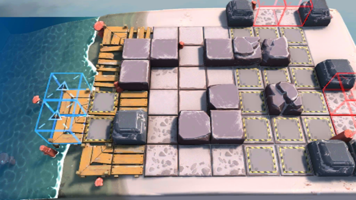

# 关卡一览————OF-3

## 关卡一览

关卡编号: OF-3

关卡名称: 竞走赛

目标点生命值: 5

敌人总数: 38

理智消耗: 24

## 关卡地图

## 敌人情况

| 敌人图片 | 敌人名称 | 数量  |
|---------|-----|-----|
| ./eneIcons/eneIcons/²½±ø.png| 步兵  |   22  |
| ./eneIcons/eneIcons/¾Ñ»÷²½±ø.png| 狙击步兵  |   5  |
| ./eneIcons/eneIcons/ÁÔ¹·pro.png| 猎狗pro  |   11  |
