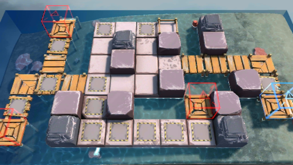

# 关卡一览————OF-5

## 关卡一览

关卡编号: OF-5

关卡名称: 别阻止我

目标点生命值: 3

敌人总数: 35

理智消耗: 24

## 关卡地图

## 敌人情况

| 敌人图片 | 敌人名称 | 数量  |
|---------|-----|-----|
| ./eneIcons/eneIcons/²½±ø.png| 步兵  |   11  |
| ./eneIcons/eneIcons/»ú¶¯ÎÀ±ø.png| 机动卫兵  |   8  |
| ./eneIcons/eneIcons/¾Ñ»÷²½±ø.png| 狙击步兵  |   4  |
| ./eneIcons/eneIcons/ÁÔ¹·pro.png| 猎狗pro  |   7  |
| ./eneIcons/eneIcons/ËéÑÒÕß.png| 碎岩者  |   5  |
