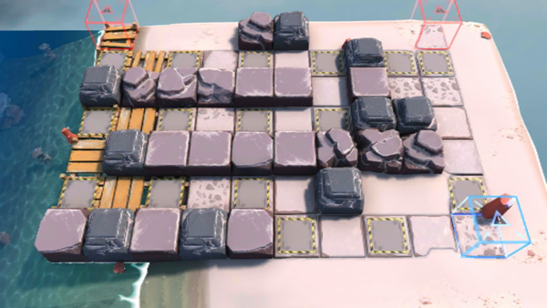

# 关卡一览————OF-6

## 关卡一览

关卡编号: OF-6

关卡名称: 杀手女皇

目标点生命值: 3

敌人总数: 49

理智消耗: 28

## 关卡地图

## 敌人情况

| 敌人图片 | 敌人名称 | 数量  |
|---------|-----|-----|
| ./eneIcons/eneIcons/²½±ø.png| 步兵  |   13  |
| ./eneIcons/eneIcons/¹¤ÒÏ.png| 工蚁  |   13  |
| ./eneIcons/eneIcons/ÁÔ¹·pro.png| 猎狗pro  |   10  |
| ./eneIcons/eneIcons/ËéÑÒÕß.png| 碎岩者  |   8  |
| ./eneIcons/eneIcons/Ìع¤.png| 特工  |   5  |
