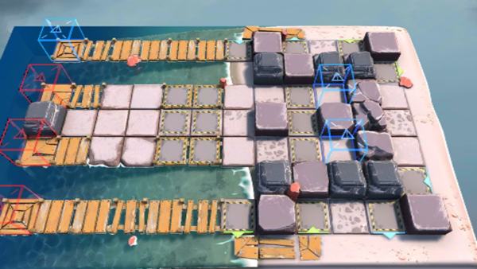

# 关卡一览————OF-7

## 关卡一览

关卡编号: OF-7

关卡名称: 一锤定音

目标点生命值: 3

敌人总数: 44

理智消耗: 30

## 关卡地图

## 敌人情况

| 敌人图片 | 敌人名称 | 数量  |
|---------|-----|-----|
| ./eneIcons/eneIcons/²½±ø.png| 步兵  |   24  |
| ./eneIcons/eneIcons/¾Ñ»÷²½±ø.png| 狙击步兵  |   8  |
| ./eneIcons/eneIcons/ËéÑÒÕß.png| 碎岩者  |   6  |
| ./eneIcons/eneIcons/Ìع¤.png| 特工  |   6  |
