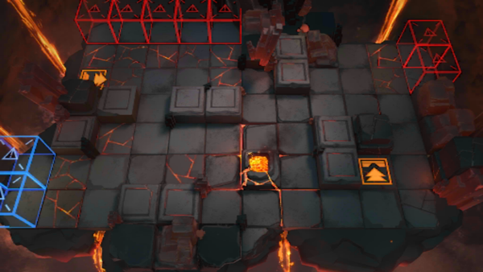

# 关卡一览————OF-8

## 关卡一览

关卡编号: OF-8

关卡名称: 汐斯塔狂想曲

目标点生命值: 3

敌人总数: 77

理智消耗: 30

## 关卡地图

## 敌人情况

| 敌人图片 | 敌人名称 | 数量  |
|---------|-----|-----|
| ./eneIcons/eneIcons/²½±ø.png| 步兵  |   5  |
| ./eneIcons/eneIcons/¾Ñ»÷²½±ø.png| 狙击步兵  |   9  |
| ./eneIcons/eneIcons/ÁÔ¹·pro.png| 猎狗pro  |   8  |
| ./eneIcons/eneIcons/ÅÓ±´.png| 庞贝  |   1  |
| ./eneIcons/eneIcons/ËáҺԴʯ³æ.png| 酸液源石虫  |   9  |
| ./eneIcons/eneIcons/ËéÑÒÕß.png| 碎岩者  |   5  |
| ./eneIcons/eneIcons/Դʯ³æ¡¤¦Â.png| 源石虫·β  |   40  |
