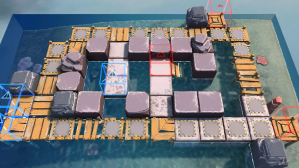

# 关卡一览————OF-EX1

## 关卡一览

关卡编号: OF-EX1

关卡名称: 预热活动

目标点生命值: 3

敌人总数: 51

理智消耗: 10

## 关卡地图

## 敌人情况

| 敌人图片 | 敌人名称 | 数量  |
|---------|-----|-----|
| ./eneIcons/eneIcons/±àÖÆÊõʦ×鳤.png| 编制术师组长  |   10  |
| ./eneIcons/eneIcons/²½±ø.png| 步兵  |   12  |
| ./eneIcons/eneIcons/²½±ø×鳤.png| 步兵组长  |   7  |
| ./eneIcons/eneIcons/»ú¶¯ÎÀ±ø.png| 机动卫兵  |   9  |
| ./eneIcons/eneIcons/»ú¶¯ÎÀ±ø×鳤.png| 机动卫兵组长  |   7  |
| ./eneIcons/eneIcons/ËéÑÒÕß.png| 碎岩者  |   5  |
| ./eneIcons/eneIcons/ÖØ×°·ÀÓùÕß-NÐÍ.png| 重装防御者-N型  |   1  |
