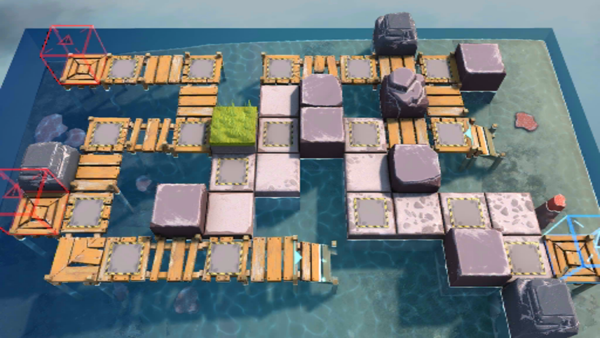

# 关卡一览————OF-EX3

## 关卡一览

关卡编号: OF-EX3

关卡名称: 采访环节

目标点生命值: 3

敌人总数: 43

理智消耗: 10

## 关卡地图

## 敌人情况

| 敌人图片 | 敌人名称 | 数量  |
|---------|-----|-----|
| ./eneIcons/eneIcons/²½±ø×鳤.png| 步兵组长  |   17  |
| ./eneIcons/eneIcons/¹¤ÒÏ.png| 工蚁  |   8  |
| ./eneIcons/eneIcons/¹¤ÒÏ×鳤.png| 工蚁组长  |   3  |
| ./eneIcons/eneIcons/¾Ñ»÷²½±ø×鳤.png| 狙击步兵组长  |   4  |
| ./eneIcons/eneIcons/ËéÑÒÕß×鳤.png| 碎岩者组长  |   4  |
| ./eneIcons/eneIcons/Ìع¤×鳤.png| 特工组长  |   7  |
