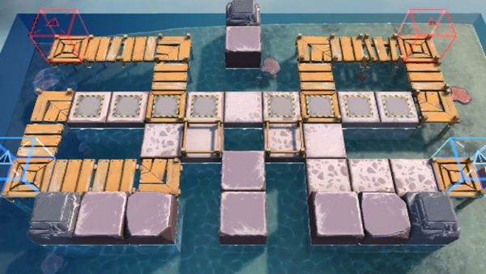

# 关卡一览————OF-EX4

## 关卡一览

关卡编号: OF-EX4

关卡名称: 渐入佳境

目标点生命值: 3

敌人总数: 57

理智消耗: 10

## 关卡地图

## 敌人情况

| 敌人图片 | 敌人名称 | 数量  |
|---------|-----|-----|
| ./eneIcons/eneIcons/±àÖÆÊõʦ×鳤.png| 编制术师组长  |   8  |
| ./eneIcons/eneIcons/²½±ø×鳤.png| 步兵组长  |   23  |
| ./eneIcons/eneIcons/»ú¶¯ÎÀ±ø×鳤.png| 机动卫兵组长  |   9  |
| ./eneIcons/eneIcons/¾Ñ»÷²½±ø×鳤.png| 狙击步兵组长  |   4  |
| ./eneIcons/eneIcons/ÁÔ¹·pro.png| 猎狗pro  |   4  |
| ./eneIcons/eneIcons/ËéÑÒÕß×鳤.png| 碎岩者组长  |   6  |
| ./eneIcons/eneIcons/ÖØ×°·ÀÓùÕß-SÐÍ.png| 重装防御者-S型  |   3  |
