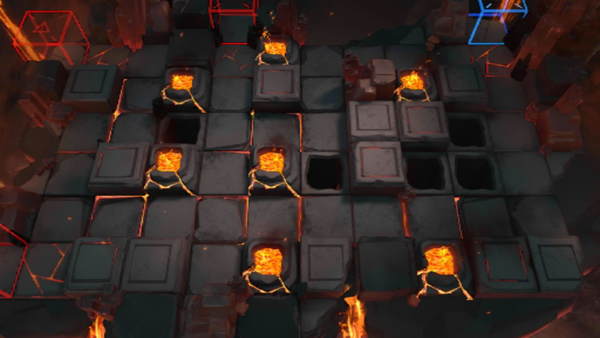

# 关卡一览————OF-EX5

## 关卡一览

关卡编号: OF-EX5

关卡名称: 高潮迭起

目标点生命值: 3

敌人总数: 62

理智消耗: 10

## 关卡地图

## 敌人情况

| 敌人图片 | 敌人名称 | 数量  |
|---------|-----|-----|
| ./eneIcons/eneIcons/±àÖÆÊõʦ×鳤.png| 编制术师组长  |   9  |
| ./eneIcons/eneIcons/²½±ø×鳤.png| 步兵组长  |   13  |
| ./eneIcons/eneIcons/¸ßÄÜԴʯ³æ.png| 高能源石虫  |   12  |
| ./eneIcons/eneIcons/»ú¶¯ÎÀ±ø×鳤.png| 机动卫兵组长  |   5  |
| ./eneIcons/eneIcons/ËáҺԴʯ³æ¡¤¦Á.png| 酸液源石虫·α  |   8  |
| ./eneIcons/eneIcons/ËéÑÒÕß×鳤.png| 碎岩者组长  |   3  |
| ./eneIcons/eneIcons/Ìع¤×鳤.png| 特工组长  |   9  |
| ./eneIcons/eneIcons/ÖØ×°·ÀÓùÕß-SÐÍ.png| 重装防御者-S型  |   3  |
