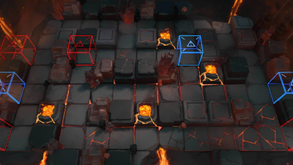

# 关卡一览————OF-EX6

## 关卡一览

关卡编号: OF-EX6

关卡名称: 完美落幕

目标点生命值: 3

敌人总数: 87

理智消耗: 10

## 关卡地图

## 敌人情况

| 敌人图片 | 敌人名称 | 数量  |
|---------|-----|-----|
| ./eneIcons/eneIcons/²½±ø.png| 步兵  |   19  |
| ./eneIcons/eneIcons/²½±ø×鳤.png| 步兵组长  |   18  |
| ./eneIcons/eneIcons/¹¤ÒÏ×鳤.png| 工蚁组长  |   17  |
| ./eneIcons/eneIcons/¾Ñ»÷²½±ø×鳤.png| 狙击步兵组长  |   15  |
| ./eneIcons/eneIcons/ËéÑÒÕß×鳤.png| 碎岩者组长  |   5  |
| ./eneIcons/eneIcons/Ìع¤.png| 特工  |   5  |
| ./eneIcons/eneIcons/ÖØ×°·ÀÓùÕß-NÐÍ.png| 重装防御者-N型  |   4  |
| ./eneIcons/eneIcons/ÖØ×°·ÀÓùÕß-SÐÍ.png| 重装防御者-S型  |   4  |
