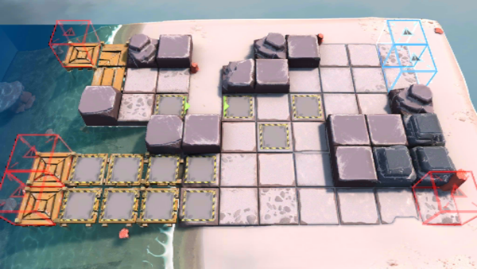

# 关卡一览————OF-F2

## 关卡一览

关卡编号: OF-F2

关卡名称: 激流勇进

目标点生命值: 5

敌人总数: 58

理智消耗: 10

## 关卡地图

## 敌人情况

| 敌人图片 | 敌人名称 | 数量  |
|---------|-----|-----|
| ./eneIcons/eneIcons/²½±ø.png| 步兵  |   26  |
| ./eneIcons/eneIcons/¾Ñ»÷²½±ø.png| 狙击步兵  |   14  |
| ./eneIcons/eneIcons/ËéÑÒÕß.png| 碎岩者  |   4  |
| ./eneIcons/eneIcons/Դʯ³æ¡¤¦Â.png| 源石虫·β  |   14  |
