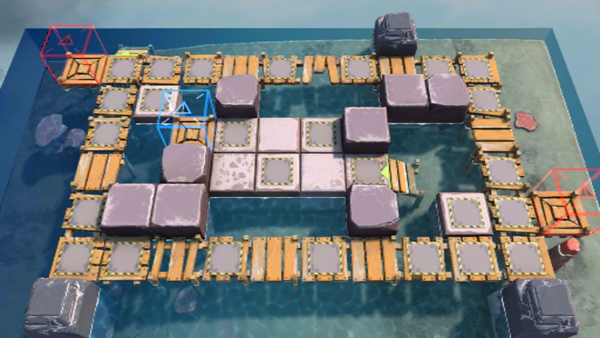

# 关卡一览————OF-F3

## 关卡一览

关卡编号: OF-F3

关卡名称: 旋转木马

目标点生命值: 3

敌人总数: 38

理智消耗: 15

## 关卡地图

## 敌人情况

| 敌人图片 | 敌人名称 | 数量  |
|---------|-----|-----|
| ./eneIcons/eneIcons/²½±ø.png| 步兵  |   12  |
| ./eneIcons/eneIcons/¹¤ÒÏ×鳤.png| 工蚁组长  |   7  |
| ./eneIcons/eneIcons/¾Ñ»÷²½±ø×鳤.png| 狙击步兵组长  |   6  |
| ./eneIcons/eneIcons/ËéÑÒÕß×鳤.png| 碎岩者组长  |   6  |
| ./eneIcons/eneIcons/Ìع¤.png| 特工  |   7  |
