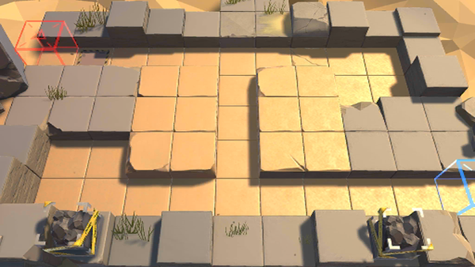

# 关卡一览————PL-1

## 关卡一览

关卡编号: PL-1

关卡名称: 深入敌阵

目标点生命值: 5

敌人总数: 29

理智消耗: 6

## 关卡地图

## 敌人情况

| 敌人图片 | 敌人名称 | 数量  |
|---------|-----|-----|
| ./eneIcons/eneIcons/·¥Ä¾»ú.png| 伐木机  |   3  |
| ./eneIcons/eneIcons/ÁÔ¹·pro.png| 猎狗pro  |   8  |
| ./eneIcons/eneIcons/DZ·üÕß.png| 潜伏者  |   10  |
| ./eneIcons/eneIcons/ÒþÐÎåóÊÖ.png| 隐形弩手  |   8  |
