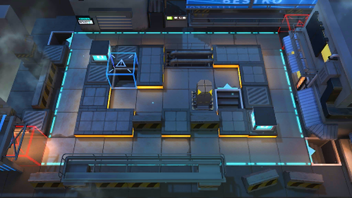

# 关卡一览————PL-2

## 关卡一览

关卡编号: PL-2

关卡名称: 混淆焦点

目标点生命值: 3

敌人总数: 53

理智消耗: 9

## 关卡地图

## 敌人情况

| 敌人图片 | 敌人名称 | 数量  |
|---------|-----|-----|
| ./eneIcons/eneIcons/²½±ø.png| 步兵  |   21  |
| ./eneIcons/eneIcons/¹¤ÒÏ×鳤.png| 工蚁组长  |   23  |
| ./eneIcons/eneIcons/ÆÛÁèÕß.png| 欺凌者  |   2  |
| ./eneIcons/eneIcons/Ìع¤.png| 特工  |   7  |
