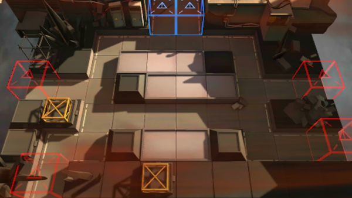

# 关卡一览————PR-A-1

## 关卡一览

关卡编号: PR-A-1

关卡名称: 防守

目标点生命值: 5

敌人总数: 29

理智消耗: 18

## 关卡地图

## 敌人情况

| 敌人图片 | 敌人名称 | 数量  |
|---------|-----|-----|
| ./eneIcons/eneIcons/Á÷ÀËÕß.png| 流浪者  |   9  |
| ./eneIcons/eneIcons/Ê¿±ø.png| 士兵  |   8  |
| ./eneIcons/eneIcons/Ë«³Ö½£Ê¿.png| 双持剑士  |   4  |
| ./eneIcons/eneIcons/Դʯ³æ¡¤¦Á.png| 源石虫·α  |   8  |
