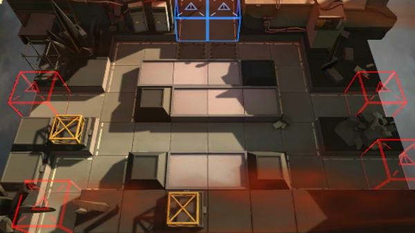

# 关卡一览————PR-A-2

## 关卡一览

关卡编号: PR-A-2

关卡名称: 据守

目标点生命值: 3

敌人总数: 38

理智消耗: 36

## 关卡地图

## 敌人情况

| 敌人图片 | 敌人名称 | 数量  |
|---------|-----|-----|
| ./eneIcons/eneIcons/¿ñ±©µÄÁÔ¹·pro.png| 狂暴的猎狗pro  |   26  |
| ./eneIcons/eneIcons/Èø¿¨×È´ó½£ÊÖ.png| 萨卡兹大剑手  |   10  |
| ./eneIcons/eneIcons/Èø¿¨×È´ó½£×鳤.png| 萨卡兹大剑组长  |   2  |
