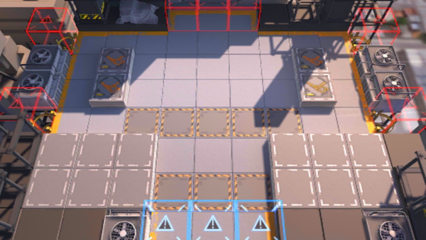

# 关卡一览————PR-B-1

## 关卡一览

关卡编号: PR-B-1

关卡名称: 干涉

目标点生命值: 5

敌人总数: 85

理智消耗: 18

## 关卡地图

## 敌人情况

| 敌人图片 | 敌人名称 | 数量  |
|---------|-----|-----|
| ./eneIcons/eneIcons/»ú¶¯¶Ü±ø.png| 机动盾兵  |   8  |
| ./eneIcons/eneIcons/Ê¿±ø.png| 士兵  |   34  |
| ./eneIcons/eneIcons/Ñý¹Ö.png| 妖怪  |   25  |
| ./eneIcons/eneIcons/Դʯ³æ.png| 源石虫  |   18  |
