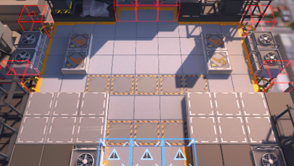

# 关卡一览————PR-B-2

## 关卡一览

关卡编号: PR-B-2

关卡名称: 打击

目标点生命值: 3

敌人总数: 91

理智消耗: 36

## 关卡地图

## 敌人情况

| 敌人图片 | 敌人名称 | 数量  |
|---------|-----|-----|
| ./eneIcons/eneIcons/Çá¼×ÎÀ±ø×鳤.png| 轻甲卫兵组长  |   24  |
| ./eneIcons/eneIcons/ÍþÁú.png| 威龙  |   1  |
| ./eneIcons/eneIcons/Ñý¹Ö.png| 妖怪  |   28  |
| ./eneIcons/eneIcons/Ñý¹ÖMKII.png| 妖怪MKII  |   11  |
| ./eneIcons/eneIcons/Óù4.png| 御4  |   3  |
| ./eneIcons/eneIcons/Դʯ³æ¡¤¦Â.png| 源石虫·β  |   24  |
