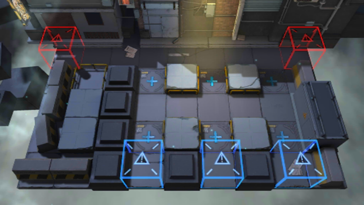

# 关卡一览————PR-C-1

## 关卡一览

关卡编号: PR-C-1

关卡名称: 急行

目标点生命值: 5

敌人总数: 46

理智消耗: 18

## 关卡地图

## 敌人情况

| 敌人图片 | 敌人名称 | 数量  |
|---------|-----|-----|
| ./eneIcons/eneIcons/¿ñ±©µÄÁÔ¹·pro.png| 狂暴的猎狗pro  |   6  |
| ./eneIcons/eneIcons/ÁÔ¹·pro.png| 猎狗pro  |   12  |
| ./eneIcons/eneIcons/Ê¿±ø.png| 士兵  |   20  |
| ./eneIcons/eneIcons/ÓÄÁé.png| 幽灵  |   8  |
