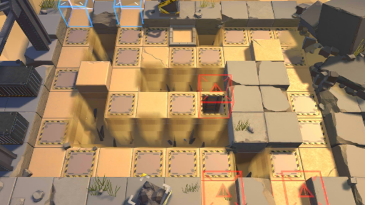

# 关卡一览————PR-D-1

## 关卡一览

关卡编号: PR-D-1

关卡名称: 突破

目标点生命值: 5

敌人总数: 74

理智消耗: 18

## 关卡地图

## 敌人情况

| 敌人图片 | 敌人名称 | 数量  |
|---------|-----|-----|
| ./eneIcons/eneIcons/»ú¶¯¶Ü±ø.png| 机动盾兵  |   13  |
| ./eneIcons/eneIcons/ÁÔ¹·.png| 猎狗  |   36  |
| ./eneIcons/eneIcons/DZ·üÕß.png| 潜伏者  |   10  |
| ./eneIcons/eneIcons/Ê¿±ø.png| 士兵  |   15  |
