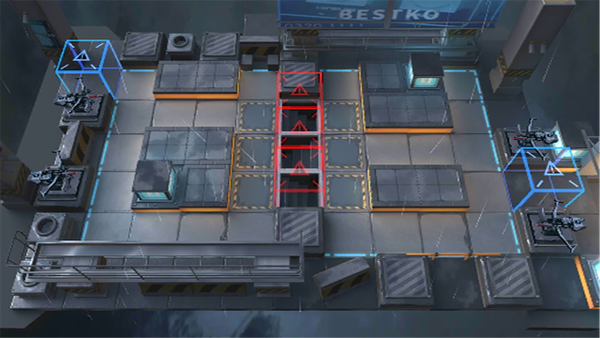

# 关卡一览————PS-2

## 关卡一览

关卡编号: PS-2

关卡名称: 风口浪尖

目标点生命值: 3

敌人总数: 38

理智消耗: 6

## 关卡地图

## 敌人情况

| 敌人图片 | 敌人名称 | 数量  |
|---------|-----|-----|
| ./eneIcons/eneIcons/±©Í½.png| 暴徒  |   26  |
| ./eneIcons/eneIcons/ÒþÐÎåóÊÖ.png| 隐形弩手  |   8  |
| ./eneIcons/eneIcons/ÒþÐÎåóÊÖ×鳤.png| 隐形弩手组长  |   4  |
