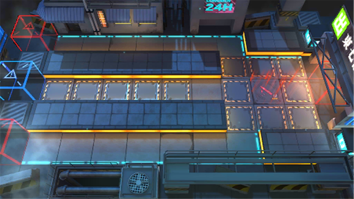

# 关卡一览————PS-3

## 关卡一览

关卡编号: PS-3

关卡名称: 磨刀

目标点生命值: 3

敌人总数: 26

理智消耗: 9

## 关卡地图

## 敌人情况

| 敌人图片 | 敌人名称 | 数量  |
|---------|-----|-----|
| ./eneIcons/eneIcons/¸ß½×Êõʦ.png| 高阶术师  |   4  |
| ./eneIcons/eneIcons/¿ñ±©µÄÁÔ¹·pro.png| 狂暴的猎狗pro  |   17  |
| ./eneIcons/eneIcons/Èø¿¨×È´ó½£ÊÖ.png| 萨卡兹大剑手  |   2  |
| ./eneIcons/eneIcons/ËÞÖ÷Á÷ÀËÕß.png| 宿主流浪者  |   1  |
| ./eneIcons/eneIcons/ËÞÖ÷Ê°»ÄÕß.png| 宿主拾荒者  |   2  |
