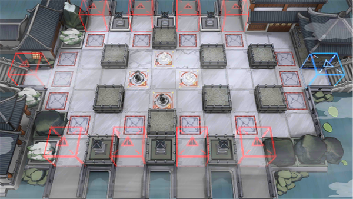

# 关卡一览————PS-4

## 关卡一览

关卡编号: PS-4

关卡名称: 自取灭亡

目标点生命值: 3

敌人总数: 80

理智消耗: 12

## 关卡地图

## 敌人情况

| 敌人图片 | 敌人名称 | 数量  |
|---------|-----|-----|
| ./eneIcons/eneIcons/»Ð㱵ġ°µÃÒ⡱.png| 恍惚的“得意”  |   28  |
| ./eneIcons/eneIcons/½¹¼±µÄ¡°Ð¡Ôꡱ.png| 焦急的“小躁”  |   18  |
| ./eneIcons/eneIcons/ÎÞġ°Ê¢Å­¡±.png| 无羁的“盛怒”  |   2  |
| ./eneIcons/eneIcons/Óػصġ°Ø°ÏÖ¡±.png| 迂回的“匕现”  |   4  |
