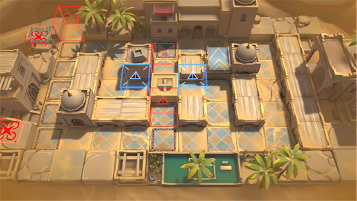

# 关卡一览————PS-5

## 关卡一览

关卡编号: PS-5

关卡名称: 竞赛

目标点生命值: 3

敌人总数: 47

理智消耗: 15

## 关卡地图

## 敌人情况

| 敌人图片 | 敌人名称 | 数量  |
|---------|-----|-----|
| ./eneIcons/eneIcons/±©û_.png| 暴鸰  |   3  |
| ./eneIcons/eneIcons/±©û_¡¤G.png| 暴鸰·G  |   4  |
| ./eneIcons/eneIcons/·´×°¼×²½±ø×鳤.png| 反装甲步兵组长  |   5  |
| ./eneIcons/eneIcons/Èø¿¨×È´©´ÌÊÖ.png| 萨卡兹穿刺手  |   2  |
| ./eneIcons/eneIcons/Õ½ÊõÁÔÈ®pro.png| 战术猎犬pro  |   33  |
