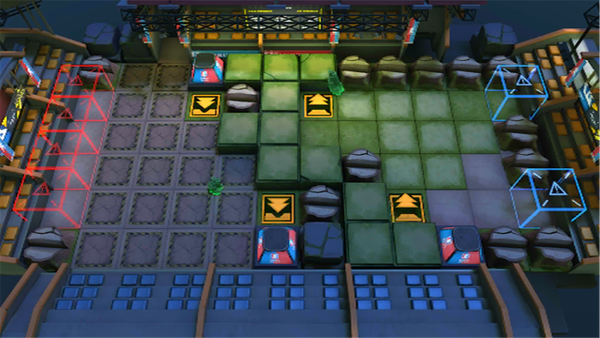

# 关卡一览————PS-6

## 关卡一览

关卡编号: PS-6

关卡名称: 双人赛

目标点生命值: 3

敌人总数: 33

理智消耗: 18

## 关卡地图

## 敌人情况

| 敌人图片 | 敌人名称 | 数量  |
|---------|-----|-----|
| ./eneIcons/eneIcons/¡°ÐâÍ­¡±°Â¶ûĬ¡¤Ó¢¸ñÀ­.png| “锈铜”奥尔默·英格拉  |   1  |
| ./eneIcons/eneIcons/¡°×óÊÖ¡±Ì©ÌØ˹¡¤°×Ñî.png| “左手”泰特斯·白杨  |   1  |
| ./eneIcons/eneIcons/·ÐѪÆïÊ¿Íž«Èñ.png| 沸血骑士团精锐  |   3  |
| ./eneIcons/eneIcons/ºôÐ¥ÆïÊ¿Íž«Èñ.png| 呼啸骑士团精锐  |   20  |
| ./eneIcons/eneIcons/ËéÑÒÕß×鳤.png| 碎岩者组长  |   4  |
| ./eneIcons/eneIcons/Óλ÷¶Ó´«Áî±ø×鳤.png| 游击队传令兵组长  |   2  |
| ./eneIcons/eneIcons/Óλ÷¶ÓÆÈ»÷ÅÚ±ø×鳤.png| 游击队迫击炮兵组长  |   2  |
