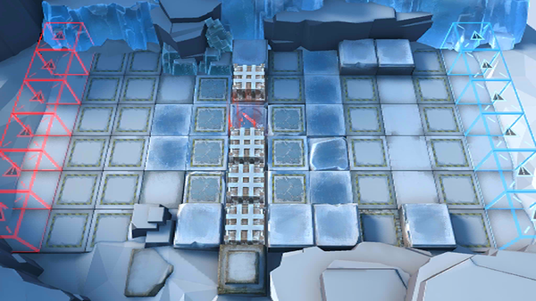

# 关卡一览————R8-11

## 关卡一览

关卡编号: R8-11

关卡名称: 落雪，浸黑国土

目标点生命值: 3

敌人总数: 52

理智消耗: 21

## 关卡地图

## 敌人情况

| 敌人图片 | 敌人名称 | 数量  |
|---------|-----|-----|
| ./eneIcons/eneIcons/¡°»ÊµÛµÄÀûÈС±.png| “皇帝的利刃”  |   2  |
| ./eneIcons/eneIcons/µÛ¹úÇ°·æ°ÙÕ½¾«Èñ.png| 帝国前锋百战精锐  |   2  |
| ./eneIcons/eneIcons/µÛ¹úÇ°·æ¾«Èñ.png| 帝国前锋精锐  |   4  |
| ./eneIcons/eneIcons/¶·Ê¿Ëþ¶À­.png| 斗士塔露拉  |   1  |
| ./eneIcons/eneIcons/¸ÐȾÕß¾À²ì¹Ù.png| 感染者纠察官  |   22  |
| ./eneIcons/eneIcons/ÎÚÈø˹ÁÑÊÞ.png| 乌萨斯裂兽  |   6  |
| ./eneIcons/eneIcons/ÎÚÈø˹ͻ»÷Õß.png| 乌萨斯突击者  |   8  |
| ./eneIcons/eneIcons/ÎÚÈø˹ͻϮåóÊÖ.png| 乌萨斯突袭弩手  |   7  |
