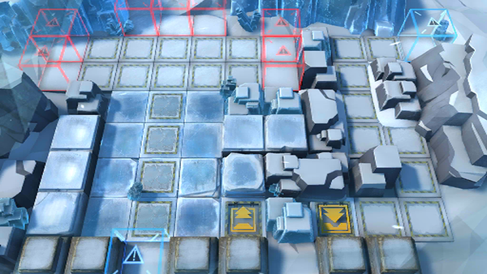

# 关卡一览————R8-3

## 关卡一览

关卡编号: R8-3

关卡名称: 麦秆，极易燃烧

目标点生命值: 3

敌人总数: 79

理智消耗: 18

## 关卡地图

## 敌人情况

| 敌人图片 | 敌人名称 | 数量  |
|---------|-----|-----|
| ./eneIcons/eneIcons/¶·Ê¿Ëþ¶À­.png| 斗士塔露拉  |   1  |
| ./eneIcons/eneIcons/¸ÐȾÕ߸߼¶¾À²ì¹Ù.png| 感染者高级纠察官  |   5  |
| ./eneIcons/eneIcons/¸ÐȾÕß¾À²ì¹Ù.png| 感染者纠察官  |   39  |
| ./eneIcons/eneIcons/ÎÚÈø˹ÁÑÊÞ.png| 乌萨斯裂兽  |   34  |
