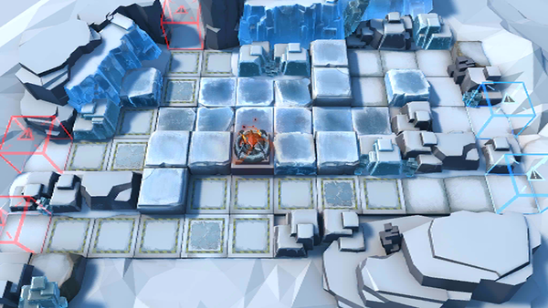

# 关卡一览————R8-6

## 关卡一览

关卡编号: R8-6

关卡名称: 战场，蔓延不止

目标点生命值: 3

敌人总数: 69

理智消耗: 18

## 关卡地图

## 敌人情况

| 敌人图片 | 敌人名称 | 数量  |
|---------|-----|-----|
| ./eneIcons/eneIcons/¶·Ê¿Ëþ¶À­.png| 斗士塔露拉  |   1  |
| ./eneIcons/eneIcons/¸ÐȾÕß¾À²ì¹Ù.png| 感染者纠察官  |   9  |
| ./eneIcons/eneIcons/ÎÚÈø˹ÁÑÊÞ.png| 乌萨斯裂兽  |   27  |
| ./eneIcons/eneIcons/ÎÚÈø˹ͻ»÷Õß.png| 乌萨斯突击者  |   11  |
| ./eneIcons/eneIcons/ÎÚÈø˹×ÅîøÊõʦ.png| 乌萨斯着铠术师  |   21  |
