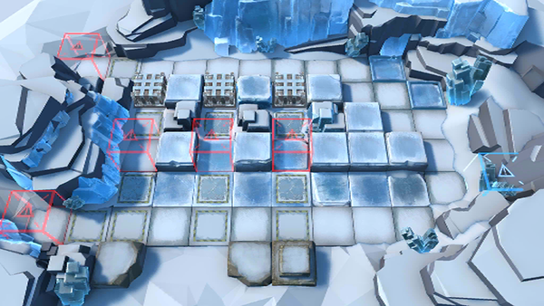

# 关卡一览————R8-9

## 关卡一览

关卡编号: R8-9

关卡名称: 相逢，总是离别

目标点生命值: 3

敌人总数: 64

理智消耗: 18

## 关卡地图

## 敌人情况

| 敌人图片 | 敌人名称 | 数量  |
|---------|-----|-----|
| ./eneIcons/eneIcons/µÛ¹úÇ°·æ¾«Èñ.png| 帝国前锋精锐  |   6  |
| ./eneIcons/eneIcons/¸ÐȾÕß¾À²ì¹Ù.png| 感染者纠察官  |   39  |
| ./eneIcons/eneIcons/ÎÚÈø˹ÁÑÊÞ.png| 乌萨斯裂兽  |   11  |
| ./eneIcons/eneIcons/ÎÚÈø˹ƽÃñ.png| 乌萨斯平民  |   3  |
| ./eneIcons/eneIcons/ÎÚÈø˹×ÅîøÊõʦ.png| 乌萨斯着铠术师  |   5  |
