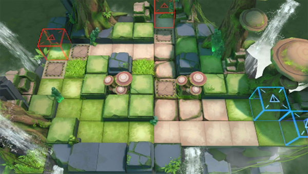

# 关卡一览————RI-2

## 关卡一览

关卡编号: RI-2

关卡名称: 粗细有别

目标点生命值: 3

敌人总数: 42

理智消耗: 9

## 关卡地图

## 敌人情况

| 敌人图片 | 敌人名称 | 数量  |
|---------|-----|-----|
| ./eneIcons/eneIcons/ÁÔ¹·.png| 猎狗  |   3  |
| ./eneIcons/eneIcons/ÌáÑÇ¿¨ÎÚͶìÊÖ.png| 提亚卡乌投矛手  |   21  |
| ./eneIcons/eneIcons/ÌáÑÇ¿¨ÎÚսʿ.png| 提亚卡乌战士  |   18  |
