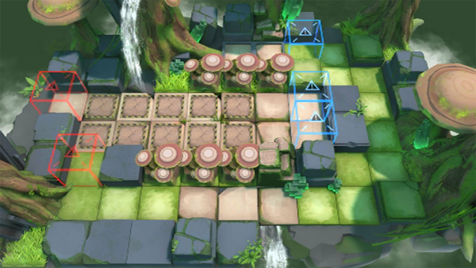

# 关卡一览————RI-3

## 关卡一览

关卡编号: RI-3

关卡名称: 往昔

目标点生命值: 5

敌人总数: 153

理智消耗: 12

## 关卡地图

## 敌人情况

| 敌人图片 | 敌人名称 | 数量  |
|---------|-----|-----|
| ./eneIcons/eneIcons/ÁÔ¹·.png| 猎狗  |   6  |
| ./eneIcons/eneIcons/ÌáÑÇ¿¨ÎÚͶìÊÖ.png| 提亚卡乌投矛手  |   8  |
| ./eneIcons/eneIcons/ÌáÑÇ¿¨ÎÚսʿ.png| 提亚卡乌战士  |   13  |
| ./eneIcons/eneIcons/Դʯ³æ.png| 源石虫  |   126  |
