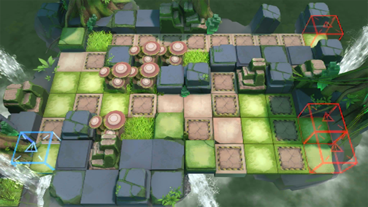

# 关卡一览————RI-4

## 关卡一览

关卡编号: RI-4

关卡名称: 机兽咆哮

目标点生命值: 3

敌人总数: 40

理智消耗: 12

## 关卡地图

## 敌人情况

| 敌人图片 | 敌人名称 | 数量  |
|---------|-----|-----|
| ./eneIcons/eneIcons/ÁÔ¹·pro.png| 猎狗pro  |   22  |
| ./eneIcons/eneIcons/ÌáÑÇ¿¨ÎÚͶìÊÖ.png| 提亚卡乌投矛手  |   8  |
| ./eneIcons/eneIcons/ÌáÑÇ¿¨ÎÚÎÀÊ¿.png| 提亚卡乌卫士  |   2  |
| ./eneIcons/eneIcons/ÌáÑÇ¿¨ÎÚÎ×Êõʦ.png| 提亚卡乌巫术师  |   3  |
| ./eneIcons/eneIcons/ÌáÑÇ¿¨ÎÚսʿ.png| 提亚卡乌战士  |   5  |
