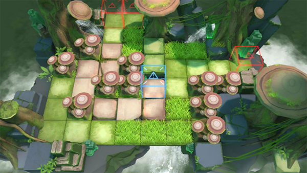

# 关卡一览————RI-5

## 关卡一览

关卡编号: RI-5

关卡名称: 各有所长

目标点生命值: 3

敌人总数: 37

理智消耗: 15

## 关卡地图

## 敌人情况

| 敌人图片 | 敌人名称 | 数量  |
|---------|-----|-----|
| ./eneIcons/eneIcons/ÌáÑÇ¿¨ÎÚºÃÕ½Õß.png| 提亚卡乌好战者  |   11  |
| ./eneIcons/eneIcons/ÌáÑÇ¿¨ÎÚÎ×Êõʦ.png| 提亚卡乌巫术师  |   4  |
| ./eneIcons/eneIcons/ÌáÑÇ¿¨ÎÚսʿ.png| 提亚卡乌战士  |   22  |
