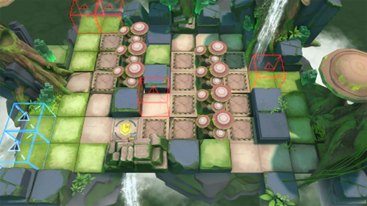

# 关卡一览————RI-7

## 关卡一览

关卡编号: RI-7

关卡名称: 有客先来

目标点生命值: 3

敌人总数: 70

理智消耗: 18

## 关卡地图

## 敌人情况

| 敌人图片 | 敌人名称 | 数量  |
|---------|-----|-----|
| ./eneIcons/eneIcons/ÌáÑÇ¿¨ÎÚͶìÊÖ.png| 提亚卡乌投矛手  |   13  |
| ./eneIcons/eneIcons/ÌáÑÇ¿¨ÎÚÓÂÊ¿.png| 提亚卡乌勇士  |   4  |
| ./eneIcons/eneIcons/ÌáÑÇ¿¨ÎÚսʿ.png| 提亚卡乌战士  |   25  |
| ./eneIcons/eneIcons/Դʯ³æ.png| 源石虫  |   28  |
