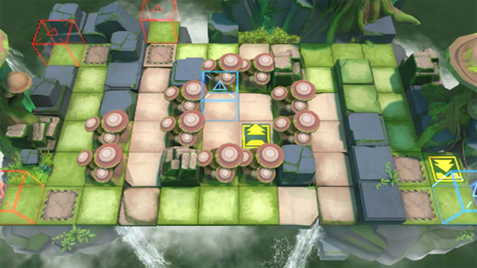

# 关卡一览————RI-8

## 关卡一览

关卡编号: RI-8

关卡名称: 嘉维尔之拳

目标点生命值: 3

敌人总数: 42

理智消耗: 18

## 关卡地图

## 敌人情况

| 敌人图片 | 敌人名称 | 数量  |
|---------|-----|-----|
| ./eneIcons/eneIcons/¡°¾Þ´óµÄ³ó¶«Î÷¡±.png| “巨大的丑东西”  |   1  |
| ./eneIcons/eneIcons/ÌáÑÇ¿¨ÎÚºÃÕ½Õß.png| 提亚卡乌好战者  |   10  |
| ./eneIcons/eneIcons/ÌáÑÇ¿¨ÎÚͶìÊÖ.png| 提亚卡乌投矛手  |   7  |
| ./eneIcons/eneIcons/ÌáÑÇ¿¨ÎÚÎ×Êõʦ.png| 提亚卡乌巫术师  |   7  |
| ./eneIcons/eneIcons/ÌáÑÇ¿¨ÎÚÓÂÊ¿.png| 提亚卡乌勇士  |   2  |
| ./eneIcons/eneIcons/ÌáÑÇ¿¨ÎÚսʿ.png| 提亚卡乌战士  |   15  |
