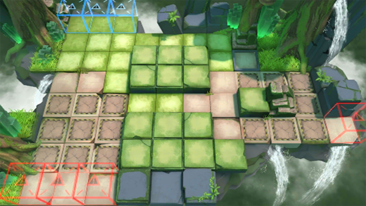

# 关卡一览————RI-EX-1

## 关卡一览

关卡编号: RI-EX-1

关卡名称: 声东击西

目标点生命值: 3

敌人总数: 76

理智消耗: 10

## 关卡地图

## 敌人情况

| 敌人图片 | 敌人名称 | 数量  |
|---------|-----|-----|
| ./eneIcons/eneIcons/ÁÔ¹·pro.png| 猎狗pro  |   30  |
| ./eneIcons/eneIcons/ÌáÑÇ¿¨ÎÚºÃÕ½Õß.png| 提亚卡乌好战者  |   10  |
| ./eneIcons/eneIcons/ÌáÑÇ¿¨ÎÚÎÀÊ¿.png| 提亚卡乌卫士  |   9  |
| ./eneIcons/eneIcons/ÌáÑÇ¿¨ÎÚսʿ.png| 提亚卡乌战士  |   27  |
