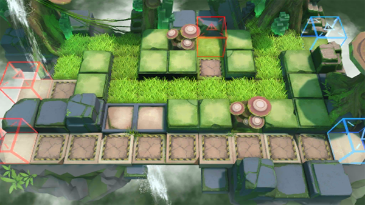

# 关卡一览————RI-EX-2

## 关卡一览

关卡编号: RI-EX-2

关卡名称: 徘徊

目标点生命值: 3

敌人总数: 55

理智消耗: 10

## 关卡地图

## 敌人情况

| 敌人图片 | 敌人名称 | 数量  |
|---------|-----|-----|
| ./eneIcons/eneIcons/ÌáÑÇ¿¨ÎÚÉñͶÊÖ.png| 提亚卡乌神投手  |   31  |
| ./eneIcons/eneIcons/ÌáÑÇ¿¨ÎÚ˺ÁÑÕß.png| 提亚卡乌撕裂者  |   4  |
| ./eneIcons/eneIcons/ÌáÑÇ¿¨ÎÚÎÀÊ¿.png| 提亚卡乌卫士  |   17  |
| ./eneIcons/eneIcons/ÌáÑÇ¿¨ÎÚսʿ.png| 提亚卡乌战士  |   3  |
