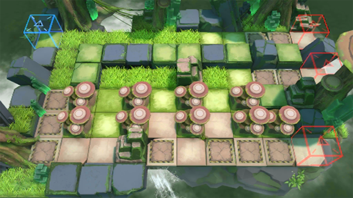

# 关卡一览————RI-EX-3

## 关卡一览

关卡编号: RI-EX-3

关卡名称: 巨蕈丛生

目标点生命值: 3

敌人总数: 41

理智消耗: 15

## 关卡地图

## 敌人情况

| 敌人图片 | 敌人名称 | 数量  |
|---------|-----|-----|
| ./eneIcons/eneIcons/ÌáÑÇ¿¨ÎÚºÃÕ½Õß.png| 提亚卡乌好战者  |   3  |
| ./eneIcons/eneIcons/ÌáÑÇ¿¨ÎÚÆÆ»µÍõ.png| 提亚卡乌破坏王  |   6  |
| ./eneIcons/eneIcons/ÌáÑÇ¿¨ÎÚÉñͶÊÖ.png| 提亚卡乌神投手  |   2  |
| ./eneIcons/eneIcons/ÌáÑÇ¿¨ÎÚ˺ÁÑÕß.png| 提亚卡乌撕裂者  |   6  |
| ./eneIcons/eneIcons/ÌáÑÇ¿¨ÎÚÎÀÊ¿.png| 提亚卡乌卫士  |   6  |
| ./eneIcons/eneIcons/ÌáÑÇ¿¨ÎÚÎ×Êõʦ.png| 提亚卡乌巫术师  |   12  |
| ./eneIcons/eneIcons/ÌáÑÇ¿¨ÎÚսʿ.png| 提亚卡乌战士  |   6  |
